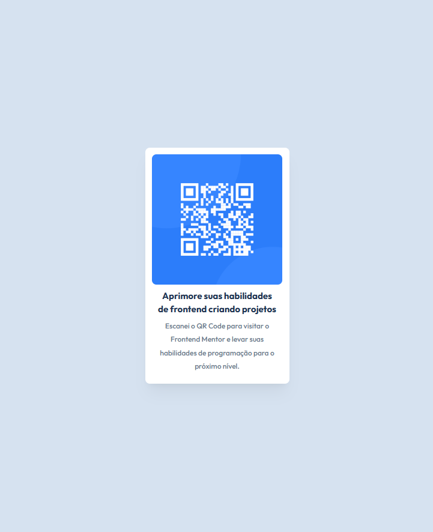

# Frontend Mentor - QR code Component

Essa é uma solução para o [desafio QR code component do Frontend Mentor](https://www.frontendmentor.io/challenges/qr-code-component-iux_sIO_H). 

## Overview

### Screenshot da Solução

## Meu Processo

### Desenvolvido com

- [React](https://react.dev/)
- [Vite](https://vite.dev/)
- [Tailwind](https://tailwindcss.com/)

### Objetivos

Praticar React com um projeto simples, aplicando o básico da biblioteca para concluir o estudo.
